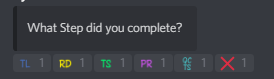
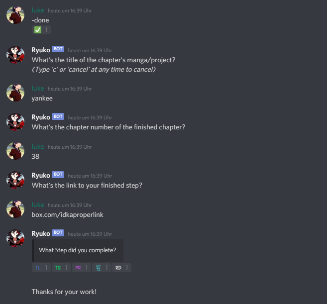

# $done

## Description

A guided command you can use when you finished a step.

## Usage

Simply answer the question the bot asks by posting messages in the chat. By typing "c" or "cancel" you cancel the process and can start over.

When it asks 

Simply click on the corresponding reaction or press X to cancel.

## Example

