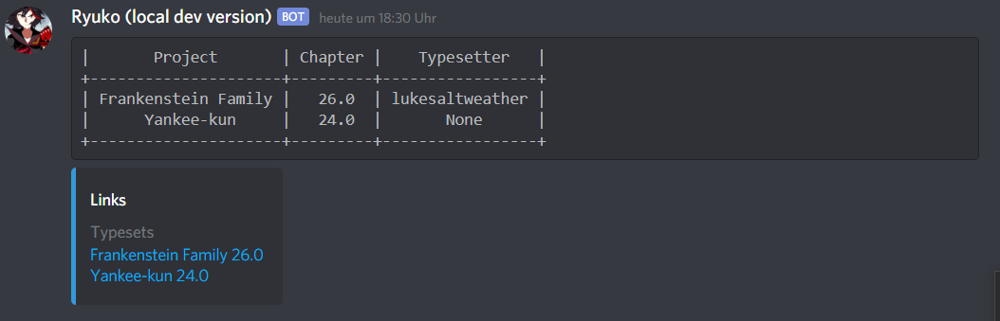
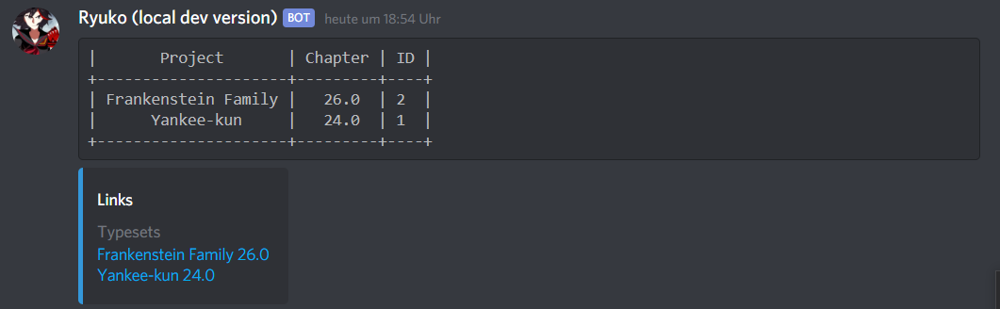

# $infochapter

## Description

Display chapters, apply various filters to get the information you need in the format you need.

## Permissions

Requires the `Neko Worker` role.

## Parameters

### Filtering

These parameters can be used to narrow down the results you get. Having to look through a table with a hundred chapters isn't very fun.

`-p=` Filter by project.

`-c=` filter by chapters with this exact same chapter number.

`-status=` filter by chapter status. Accepts values: `active, tl, rd, ts, pr, qcts, ready`

`-chapter_from=` filter for chapter numbers from this point on.  
Example: -chapter\_from=21 will only give back chapters with number 21 and higher.

`-chapter_upto=` similar to `-chapter_from` but will only include chapter up \(so including\) the specified point.

`-title=`filter for chapters with this specific title.

`-id=` filter by chapter id. Will only return a single chapter, if at all.

`-tl= -ts= -rd= -pr=` use these parameters to filter by staff. Discord IDs will give the most accurate results, but the username works fine as well. Nicknames _can work,_ but aren't as reliable.

`-link_tl -link_rd= -link_ts= -link_pr= -link_qcts=` These parameters let you filter by the links of the chapters. Why is this useful? You can also use the value `None` to search for chapters with a link missing.

`-creation_on= -creation_from= -creation_upto=` These can be used to filter by date. `creation_on` will return chapters created on a single day, `creation_from` filters by chapters created from a certain day on, and `creation_upto` will filter by chapters created up to \(including\) a certain day. `creation_on` can also have the value _`None`,_ that way it searches for chapters with no creation date.


On date formatting:

The bot always uses YYYY MM DD as its date format. Exactly this way, with the spaces included. It won't accept any other formats.


`-tl_on= -tl_from= -tl_upto=` These can be used to filter by date. `tl_on` will return chapters with translations finished on a specific day, `ts_from` filters by chapters translated from a certain day on, and `tl_upto` will filter by chapters translated up to \(including\) a certain day. `tl_on` can also have the value _`None`,_ that way it searches for chapters with no creation date.


Parameters with the same functionality exist for `rd`, `ts`, `pr, rl` and `qcts`


### Fields

You can tell the bot what to display in the table it responds with, and even in what order using the parameter `-fields=`. Using this is also very easy. However, it will always include the Project's title and the chapter number. Here's a short example:

```text
$infochapters -fields=ts,ts_link
```

It should be noted that due to limitations with Discord, links can't be sent in the table. The result of this command:



As you can see, it's very straightforward. You can use however many rows you like, even none or the same one multiple times. You can find a list of what you can display below:

| Row | What does it contain? |
| :--- | :--- |
| title | The chapter's title |
| id | The chapters' internal ID |
| link\_xyz | xyz can either be _TL, TS, RD, PR, RL_ \(aka _QCTS_\) or _raw_ |
| tl | Translator |
| rd | Redrawer |
| ts | Typesetter |
| pr | Proofreader |
| d\_c | Date created |
| d\_xyz | Date a step finished. xyz can be either _TL, TS, RD, PR_ or _RL_ \(aka QCTS\) |

### Miscellaneous

`-links=`  Whether to send the hyperlinks of individual steps with the results. Accepts `true, yes, y`

**`-output=`** Can have two values, _**`image`**_ or _**`text`**_. If not specified otherwise, the bot's standard setting is _**`image`**_ and it will return the table in an image, rather than through text.

**`-order_by=`** very experimental feature as of now, since it will just insert the value directly into the database query. You can put the name of one of the fields here \(with the table name in front, so either _`chapters`,_ _`projects`_ or _`staff`_\) , followed by either desc \(so descending order\) or asc \(ascending order\). An example of this:

```text
 -infochapters -fields=link_ts -order_by=chapters.id desc -output=text
```



