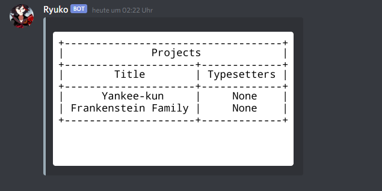

# $infoproject

## Description

Retrieve information about one or multiple projects.

## Permissions

Requires the `Neko Worker` role.

## Parameters

### Filtering

These parameters can be used to narrow down the results you get.

`-p=` Filter by project title.

`-id=` Filter by chapter id. Will only return a single projectr, if at all.

`-tl= -ts= -rd= -pr=` use these parameters to filter by staff. Discord IDs will give the most accurate results, but the username works fine as well. Nicknames _can_ work_,_ but aren't as reliable.

`-status=` Filter by status. Most projects are going to be either a`ctive` or `inactive`.

`-all=` The value here can be anything. If this parameter is used \(AND no other filtering is applied\) all chapters will be output.

### Fields

You can tell the bot what to display in the table it responds with, and even in what order using the parameter `-fields=`. Using this is also very easy. Here's a short example:

```text
$infoproject -fields=title,ts
```

It should be noted that due to limitations with Discord, links can't be sent in the table. The result of this command:



As you can see, it's very straightforward. You can use however many rows you like, even none or the same one multiple times. You can find a list of what you can display below:

| Row | What does it contain? |
| :--- | :--- |
| title | The chapter's title |
| id | The chapters' internal ID |
| tl | Translator |
| rd | Redrawer |
| ts | Typesetter |
| pr | Proofreader |
| link | Outputs project links. |
| status | Project status |
| altNames | Output alternative names. |

### Miscellaneous

**`-output=`** Can have two values, _**`image`**_ or _**`text`**_. If not specified otherwise, the bot's standard setting is _**`image`**_ and it will return the table in an image, rather than through text.

**`-order_by=`** very experimental feature as of now, since it will just insert the value directly into the database query. You can put the name of one of the fields here \(with the table name in front, so either _`chapters`,_ _`projects`_ or _`staff`_\) , followed by either desc \(so descending order\) or asc \(ascending order\). 


