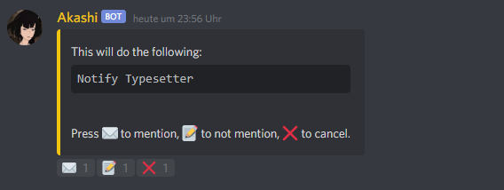

# How to: finish a chapter


You can also simply use the command [$done](../commands/done.md) which will simply ask questions you respond to, and updates the database according to your answers.


To mark a chapter as finished, there's a series of commands, each used for their respective step.

There's [donetl](../commands/donetl.md) \(Translation\), [donerd](../commands/donerd.md) \(Redraws\), [donets](../commands/donets.md) \(Typeset\), [donepr](../commands/donepr.md) \(Proofread\) and [doneqcts](../commands/doneqcts.md) \(QCTypeset\).

For the sake of this tutorial, we've just finished the redraws for _Chapter 1_ of _Yankee-kun._

I'm going to show you the command we're using first, then explain what each part does.

```text
$donerd -p=Yankee -c=1 -link=https://box.com/
```

Let's go over this. $ is the bot's prefix, and must be at the start of the message.`donerd` is the command we're using. It tells the bot to mark the chapter's _redraws_ as finished. Note that there is no space between prefix and command. 

For that, we need to tell the bot three things: the _project's name \(p\)_, the _chapter number \(c\)_, and the _link_ to the redraws we just finished.

We call the text after the main command \(donerd\) **parameters** \(you can also think of them as options or settings with specific values\), which are written like this:


They _**always**_ start with a space and a dash `-` and are _**always**_ separated by their value through the equal sign `=`. 


So we have the options/settings:

| Plain text | Setting | Value |
| :--- | :--- | :--- |
| -p=Yankee | Project Title | Yankee |
| -c=1 | Chapter Number | 1 |
| -link=https://box.com | Link to step | https://box.com |

If you understood all of this, you're pretty much good to go. One small thing: After you use the command, a message will pop up:



To complete the command, you'll have to react with ✉️ or ✏️.  ✉️ will properly ping and notify the next staffmember\(s\). Reacting with ✏️will still send the message to fileroom, _mentions_ the role/member, but _doesn't_ actually notify them.

